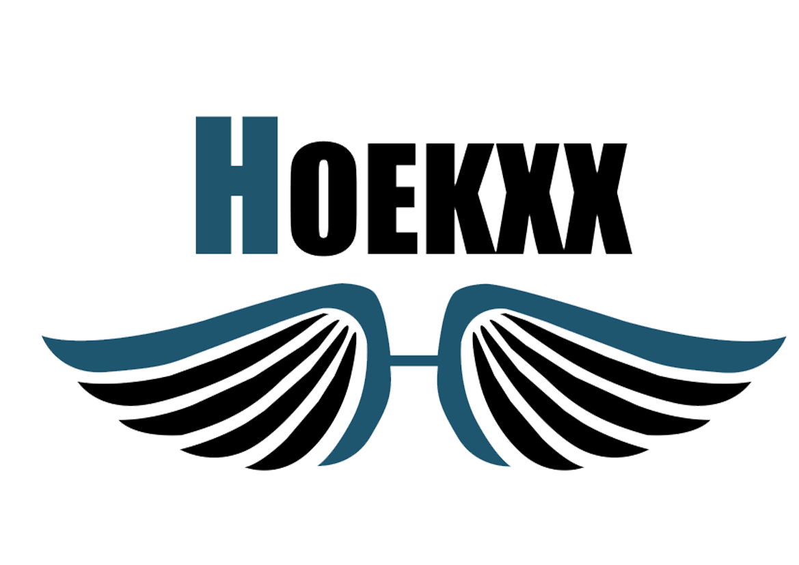

# HOEKXX - Tu Tienda en Línea

Bienvenido a HOEKXX, tu destino en línea para productos increíbles. Este e-commerce está construido con React y diseñado para ofrecer una experiencia de compra inigualable. ¡Descubre nuestras ofertas y encuentra exactamente lo que necesitas!

## Características

- **Navegación Sencilla**: Navega por nuestro sitio de forma intuitiva y encuentra productos fácilmente.

- **Catálogo de Productos**: Explora nuestro amplio catálogo de productos organizados en categorías.

- **Detalles del Producto**: Consulta información detallada sobre cada producto, incluyendo imágenes, descripción, precio y disponibilidad.

- **Carrito de Compras**: Agrega productos a tu carrito y finaliza tu compra de manera sencilla.

- **Proceso de Pago Seguro**: Realiza pagos seguros a través de métodos de pago confiables.

## Tecnologías Utilizadas

- React
- Javascrip

## Instalación

Sigue estos pasos para ejecutar el proyecto en tu máquina:

1. Para instalar las dependencias:

- npm install

2. Para iniciar la aplicación:
- npm start

3. Para compilar la aplicación para producción:
- npm run build